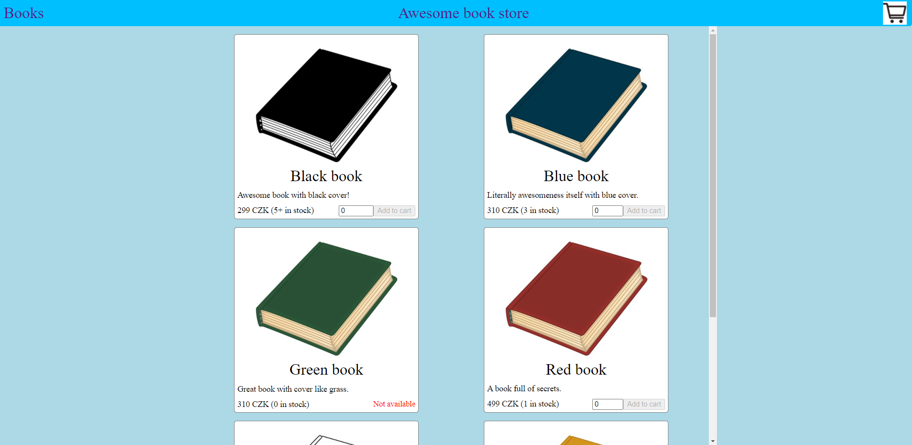
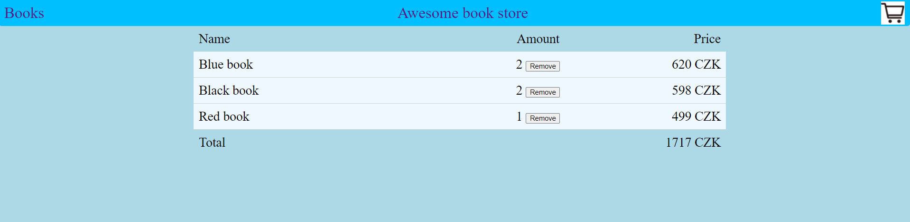

# DESO applicants assignment
## Introduction
Dear applicant, we would like to see what are your skills regarding javascript and especially React.js framework. 
This is a simple assignment that we expect to take 1-2 hours to complete depending on your skills.

## Goals
<ol>
<li>Please refactor given code to reflect what practices and patterns you apply when writing code.</li>
<li>Please use some versioning software (such as gitlab or github) and use its functionality to show your thought 
process and steps you took to solve the assignment.</li>
<li>We do not care about fancy styling. Really basic styling is sufficient for this purpose. 
You can use any library that you prefer, you can do it yourself, or you can use attached css file. 
(Please do not spend time on styling, we prefer to see better code than fancy styling)</li>
<li>Solution can look as follows (if you use provided styles):
    
    
</li>
</ol>

## Requirements
<ol>
<li>As a user I would like to see all books in store.</li>
<li>As a user I would like to add a book (with specified amount) to cart.</li>
<li>As a user I would like to see what items I have in cart.</li>
<li>As a user I would like to remove an item from cart.</li>
<li>As a user I do not want my window reloading the application when I change the view.</li>
<li>As a developer I would like to maintain, extend the functionality, and make changes to code easily.</li>
<li>As a developer I want to minimize number of props passed between components.</li>
<li>As a developer I want to add more books without making (nearly any) changes to javascript code.</li>
<li>As a developer I want to add new products (such as magazine) without making (major) changes to javascript code.</li>
<li>As a developer I do not want to let user fill the inputs with invalid values or values that cannot be processed by the store.</li>
<li>As a developer I do not want to let user add an item to cart with amount = 0.</li>
</ol>

Feel free to use any available node package to solve the assignment. Good luck!

